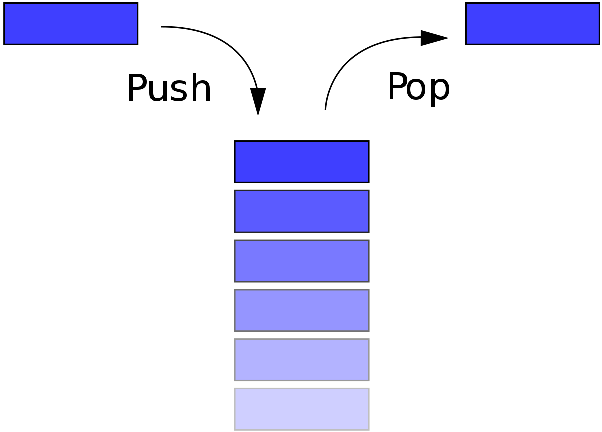
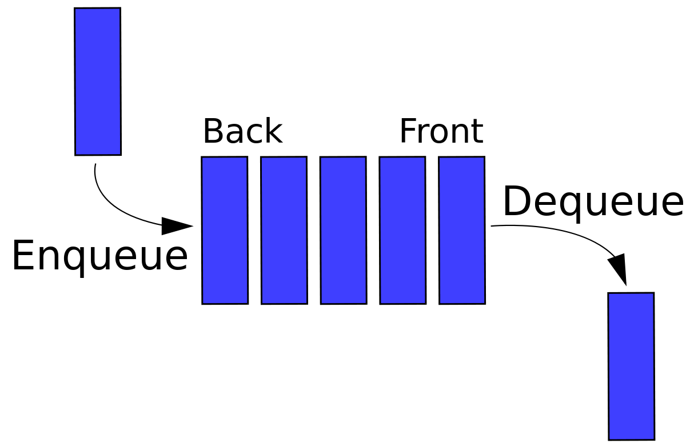

# Pilhas e filas
## Pilha (stack): LIFO
- Last in, first out - Último a entrar, primeiro a sair
- O último item a ser inserido estará no topo da pilha (ou seja, será o primeiro item). Esse item no topo será removido ao ler a pilha.
- Exemplo: uma pilha de pratos.

## Fila (queue): FIFO
- First in, first out - Primeiro a entrar e primeiro a sair
- O primeiro item a entrar na fila será o primeiro item a sair.
- Exemplo: uma fila de supermercado.

